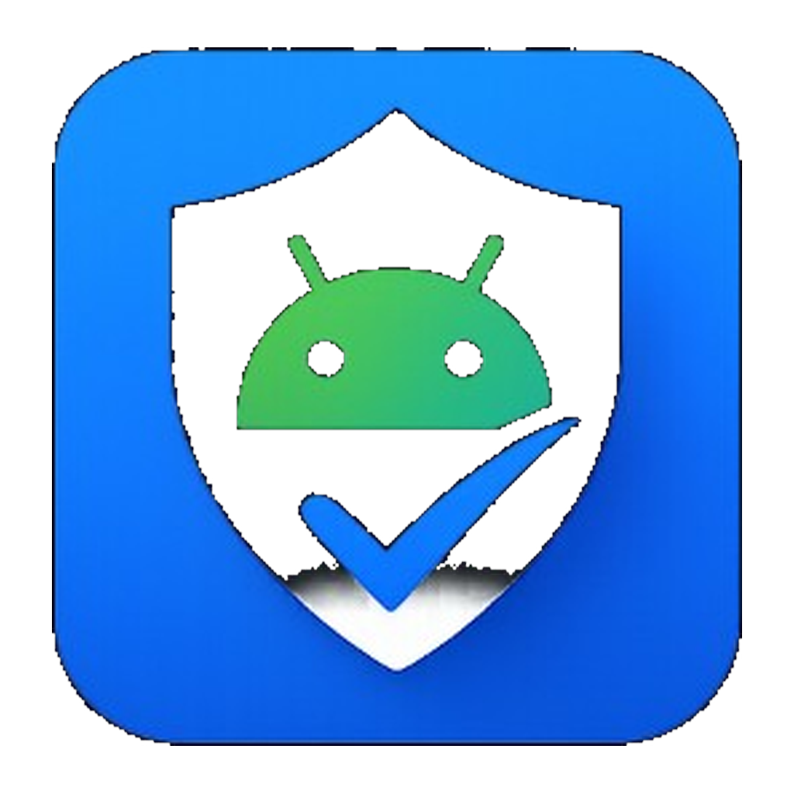
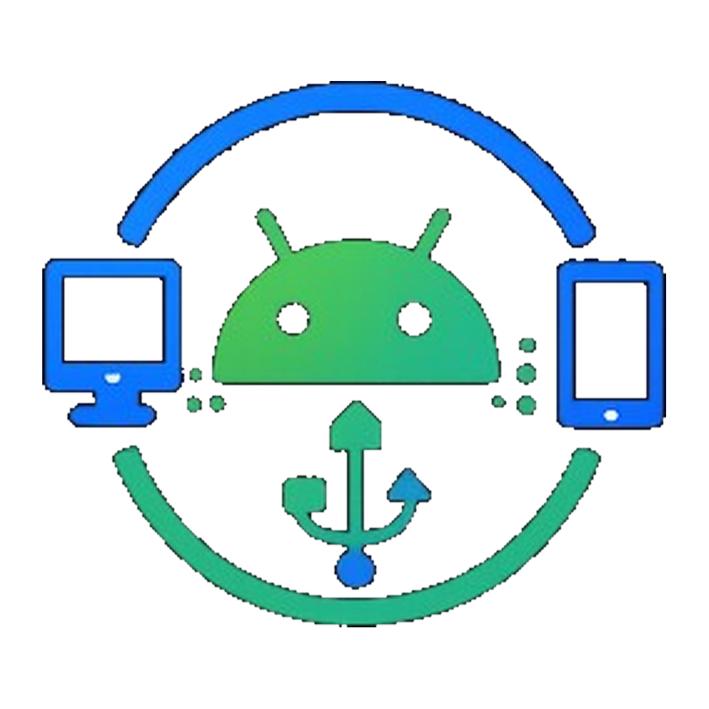

<p align="center">
  
</p>

<h1 align="center">Say No to Bloatware</h1>

<p align="center">A desktop debloater for Android — find and remove pre-installed bloatware over USB, no root required.</p>

---

**Say No to Bloatware (SNB)** is a cross-platform desktop app that connects to your Android device
over ADB, classifies installed apps against a bloatware database, and lets you safely remove (or, when
a manufacturer blocks that, disable) the ones you don't want. ADB and the on-device companion app are
bundled — there's nothing to install manually.

## Documentation

Full docs live in **[docs/](docs/README.md)**:

- [Getting Started](docs/getting-started.md) — requirements, USB debugging, first scan.
- [User Guide](docs/user-guide.md) — every screen and feature.
- [Architecture](docs/architecture.md) — how the components fit together.
- [Build from Source](docs/build-from-source.md) — build, run, test, publish.
- [Troubleshooting](docs/troubleshooting.md) — fixes for common issues.

## Subprojects

| Logo | Folder | Description |
|------|--------|-------------|
|  | [SNB Desktop](SNB%20Desktop/) | Cross-platform desktop client (Avalonia / .NET 10). Contains the GUI (`SNB.Desktop`), shared logic (`SNB.Backend`), and a console front-end (`SNB.Cli`). |
|  | [SNB Bridge](SNB%20Bridge/) | Android bridge app — runs an HTTP server on the device and exposes installed-app data over ADB port forwarding. See its [README](SNB%20Bridge/README.md) for the full HTTP API. |

## Quick start

**Use the desktop app** (most users): grab a release or build from source, connect your phone with
USB debugging enabled, and scan. See [Getting Started](docs/getting-started.md).

**Build from source:**

```bash
# Desktop client
dotnet run --project "SNB Desktop/src/SNB.Desktop/SNB.Desktop.csproj"

# Bridge app (optional — a prebuilt APK already ships in Bridge/)
cd "SNB Bridge"; flutter pub get; flutter build apk --release
```

See [Build from Source](docs/build-from-source.md) for the full developer setup.

## Layout

```
Say No to Bloatware/
├── README.md          ← this file
├── docs/              ← documentation
├── Assets/            ← bundled runtime assets (ADB, database, device images)
├── Bridge/            ← snb_bridge.apk deployed to devices
├── SNB Bridge/        ← Flutter Android app (source)
└── SNB Desktop/       ← .NET 10 solution (GUI + backend + CLI)
```

## License

MIT License. See the [About](docs/user-guide.md#6-about) page in-app for details.
