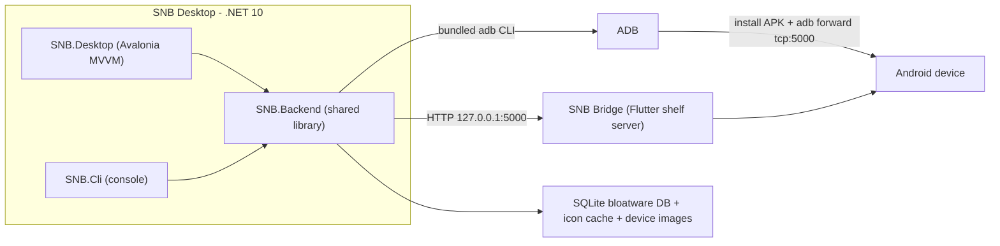
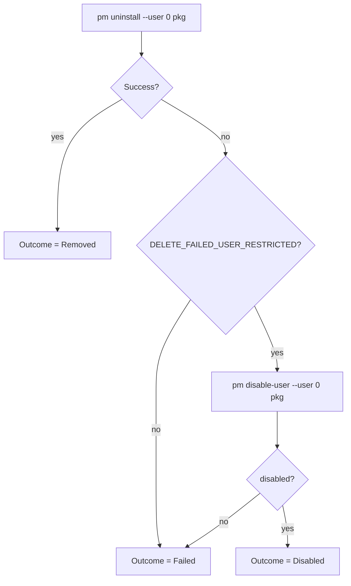

# Architecture

This page explains how SNB is put together for developers and curious users.

## High-level overview

SNB has three cooperating components: the **desktop client**, the shared **backend** library, and an
**on-device bridge** app. The desktop drives everything over ADB; the bridge supplies richer app data
(icons, sizes, permissions) that raw ADB shell commands can't easily provide.

## Projects

The .NET solution lives at [SNB Desktop/SNB.sln](../SNB%20Desktop/SNB.sln). All projects target
**net10.0**.

| Project | Path | Role |
|---------|------|------|
| `SNB.Desktop` | [src/SNB.Desktop](../SNB%20Desktop/src/SNB.Desktop) | Avalonia MVVM GUI (the main app). `WinExe`. |
| `SNB.Backend` | [src/SNB.Backend](../SNB%20Desktop/src/SNB.Backend) | Shared logic: ADB, bridge client, database, matching. |
| `SNB.Cli` | [src/SNB.Cli](../SNB%20Desktop/src/SNB.Cli) | Interactive console front-end over the same backend. |
| `SNB.Backend.Tests` | [tests/SNB.Backend.Tests](../SNB%20Desktop/tests/SNB.Backend.Tests) | xUnit tests for the backend. |

## Desktop (SNB.Desktop)

- **UI framework:** Avalonia 11.3 with the Fluent theme, `CommunityToolkit.Mvvm` for MVVM, and
  compiled bindings.
- **Composition root:** [App.axaml.cs](../SNB%20Desktop/src/SNB.Desktop/App.axaml.cs) registers the
  backend (`AddSnbBackend()`) plus desktop services and view models in DI, restores the persisted
  theme/language, and best-effort stops the bridge on shutdown.
- **Navigation:** a custom `INavigationService`
  ([NavigationService.cs](../SNB%20Desktop/src/SNB.Desktop/Services/NavigationService.cs)) manages
  three independent slots — a **page**, a centered **dialog**, and a right-docked **panel**. The shell
  (`MainWindowViewModel`) binds to these. View models are resolved by type (`NavigateTo<T>()`).
- **Theming & i18n:** colors are defined per `ThemeVariant` in
  [Themes/Colors.axaml](../SNB%20Desktop/src/SNB.Desktop/Themes/Colors.axaml); strings come from
  `Assets/i18n/en.json` and `ta.json` via a `{l:Loc}` markup extension. Both choices persist through a
  small JSON `PreferencesService`.

## Backend (SNB.Backend)

Registered in
[ServiceCollectionExtensions.cs](../SNB%20Desktop/src/SNB.Backend/DependencyInjection/ServiceCollectionExtensions.cs).
Major services:

| Service | Role |
|---------|------|
| `DeviceSessionOrchestrator` | Top-level coordinator: detect devices, deploy bridge, scan apps, match bloatware, fetch icons/images, drive removals. Holds the current device state. |
| `BridgeDeploymentService` | Sets up `adb forward`, health-checks the bridge, and installs/launches the APK only when missing or outdated. |
| `AppRemovalService` | Uninstalls apps (with a disable fallback) and returns per-app `RemovalResult`s. |
| `BloatwareSyncService` | Downloads OEM/misc bloatware lists into the SQLite DB. |
| `BloatwareCacheService` / `BloatwareMatcher` | Cache definitions and classify apps into All / Recommended / Has-alternatives. |
| `IconCacheService` | Caches app icons on disk. |
| `DeviceMetadataService` / `DeviceImageService` / `DeviceImageMatcher` | Resolve a photo for the connected device (exact + fuzzy matching). |

Infrastructure:

- **ADB** — [Infrastructure/Adb](../SNB%20Desktop/src/SNB.Backend/Infrastructure/Adb): `AdbProcessRunner`
  shells out to the bundled `adb` (device list, getprops, install/uninstall/disable, port-forward);
  `AdbLocator` finds the binary; `AdbOutputParser` interprets results.
- **Bridge client** — [Infrastructure/Bridge](../SNB%20Desktop/src/SNB.Backend/Infrastructure/Bridge):
  `BridgeHttpClient` talks HTTP to the on-device bridge through the forwarded port.
- **Database** — [Infrastructure/Database](../SNB%20Desktop/src/SNB.Backend/Infrastructure/Database):
  `DatabaseInitializer` seeds/opens SQLite; repositories for packages, sources, and app icons.

## On-device bridge (SNB Bridge)

A Flutter app, package `com.prasanth.snb.bridge`, that runs a `shelf` HTTP server on the device
(default port **5000**) and exposes installed-app metadata and icons. Native enumeration is done in
Kotlin (`PackageManagerBridge.kt`) over a method channel. The desktop reaches it at
`http://127.0.0.1:5000/` through `adb forward`.

For the full endpoint reference (`/health`, `/apps`, `/apps/full`, `/apps/query`,
`/icon/{packageName}`), see the **[Bridge HTTP API](../SNB%20Bridge/README.md)**.

## How removal works

After a successful removal/disable, the orchestrator prunes the package from its in-memory catalog so
the UI updates without a full re-scan.

## Data and bundled assets

The desktop bundles everything it needs to run; assets live under the repo's `Assets/` and are copied
next to the binary at build/publish time, then resolved at runtime from the app's base directory.

| Asset | Bundled from | Runtime use |
|-------|--------------|-------------|
| ADB binaries | `Assets/ADB/Windows`, `Assets/ADB/Linux` | Run all device commands. |
| Bridge APK | `Assets/Bridge/snb_bridge.apk` | Installed on the device on first connect (copied next to the binary as `Bridge/snb_bridge.apk`). |
| Bloatware DB | `Assets/Database/snb.db` → `Default/snb.db` | Seeded into a writable `Cache/snb.db`; synced from remote lists. |
| Device images | `Assets/Images/default-*.png` | Per-brand fallback photos for detected devices. |
| Icon cache | (generated) `Cache/Icons` | Stores fetched app icons between runs. |
