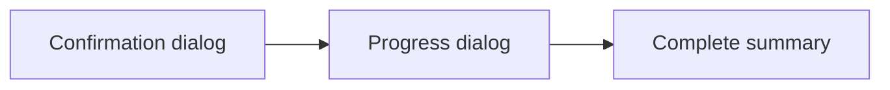

# User Guide

A complete walkthrough of every screen in SNB Desktop. If you haven't connected a device yet, start
with [Getting Started](getting-started.md).

## Sidebar and navigation

The left sidebar is your main navigation:

- **Select Device** — pick or change the connected device.
- **Applications** — review and remove apps (enabled once a device is connected).
- **Settings** — theme, language, and database/cache info.
- **About** — version, links, and license.

It also shows a USB-debugging hint and, once connected, a "Connected device" summary with a
**Change Device** button.

## 1. Select a device

The **Select a Device** screen lists every device ADB can currently see, each shown as a card with:

- a photo of the phone (matched from the device's brand/model), and
- details such as serial number, manufacturer, model, SDK version, and battery.

Controls:

- **Refresh** — re-detect connected devices (use this after plugging in or authorizing USB debugging).
- Click a card to **connect** to that device.

If no devices appear, see [Troubleshooting → Device not detected](troubleshooting.md#device-not-detected).

### What happens when you connect

On connecting, SNB prepares the device:

1. Sets up an ADB port-forward to the on-device bridge.
2. Installs and launches the **SNB Bridge** companion app (first time only, or when an update is bundled).
3. Lists installed packages and matches them against the bloatware database.
4. Fetches app icons and the device image.

The first connection is the slowest; later scans reuse the installed bridge and cached icons.

## 2. Applications screen

This is where you review and act on installed apps.

### Statistics strip

A summary row shows **Total Apps**, **Recommended Removal**, and **Apps with Alternatives** counts
for the connected device.

### Tabs

Filter the list by category:

- **All Apps** — every installed app.
- **Recommended Removal** — apps the bloatware database flags as safe-ish to remove.
- **Apps with Alternatives** — bloat that has a known better/standard replacement.

### Search and sort

- **Search** — filter by app name or package name.
- **Sort** — choose **Name**, **Package name**, **Size**, or **App type**.
- **Sort direction** — the chevron button toggles ascending/descending.

### Selecting apps

- Tick the checkbox on any app card to select it.
- **Select All** (footer) selects/deselects everything in the current filtered view.
- The footer shows a live **"N selected"** count.

### App details

Open an app's details to see its package name, type (system/user), category, size, version, and
source, alongside its icon.

### Refreshing

- **Scan Again** (top right) re-scans the device. The list also stays in sync automatically after a
  removal — apps you just removed disappear without a full re-scan.

## 3. Removing apps

Select one or more apps, then click **Remove Selected (N)** in the footer. The removal runs as a
three-step flow:

1. **Confirmation** — review the exact list to be removed. Removal is for the current user and cannot
   be undone from here, so double-check.
2. **Progress** — each app is processed in turn with a live status.
3. **Complete** — a summary with counts for **Removed**, **Disabled**, **Failed**, and **Space Freed**,
   plus a per-app breakdown.

### Outcomes: Removed, Disabled, Failed

SNB first tries to uninstall an app for the current user (`pm uninstall --user 0`). Each app ends in
one of three states:

| Outcome | Meaning |
|---------|---------|
| **Removed** (green) | The app was uninstalled for the current user. |
| **Disabled** (amber) | The manufacturer blocked uninstalling this protected app, so SNB disabled it instead — it stops running and disappears from the launcher. |
| **Failed** (red) | The app could not be removed or disabled. A reason is shown. |

The **Disabled** fallback only triggers for the specific "user restricted" uninstall case, so apps
that fail for other reasons are never silently disabled.

> **Manufacturer-protected apps (e.g. Vivo):** Some OEMs block *both* uninstall and disable for the
> ADB shell user without root. In that case the app shows **Failed** with a message like
> "Protected by the device manufacturer — can't be removed or disabled without root access." This is
> a device limitation, not a bug. See [Troubleshooting](troubleshooting.md#an-app-cant-be-removed-or-disabled).

## 4. Export the app list

Click **Export** on the Applications screen to save the **current, filtered** list.

1. Choose a format: **CSV** (spreadsheet-friendly) or **JSON** (machine-readable).
2. Pick a location in the native **Save As** dialog.

Exported fields include app name, package name, type, category, size, version, and source.

## 5. Settings

Settings are grouped into **Database**, **Cache**, and **Other**:

- **Database**
  - **Database Version** — the date of the bundled or last-synced bloatware database.
  - **Last Sync** — when the bloatware lists (`oem.json`, `misc.json`) were last downloaded.
  - **Auto Update Database** — when enabled, SNB syncs those lists in the background on startup.
- **Cache**
  - **Icon Cache Location** — path where fetched app icons are stored on disk.
  - **Clear Icon Cache** — removes cached icons (with a confirmation dialog).
- **Other**
  - **Theme** — **Light** or **Dark**. The choice applies instantly and is remembered across restarts.
    (Default is Light.)
  - **Language** — **English** or **தமிழ் (Easy)** (Tamil). Also applied live and remembered.

## 6. About

Shows the app version, developer, license, and quick links (Website, GitHub, Report an Issue,
Documentation, License). The **Documentation** link opens this documentation set.
